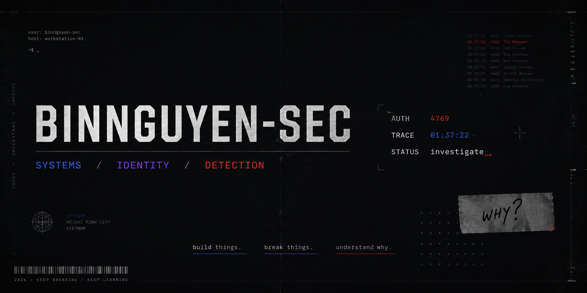
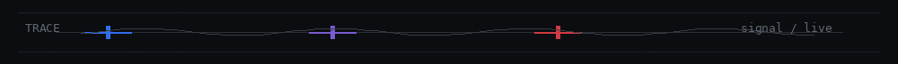
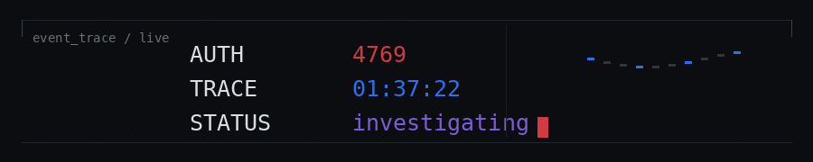

  

 

**Cybersecurity student. Mostly somewhere between networks, identity, systems — and the logs they leave behind.**

SOC · Network Security · Active Directory · Detection Engineering

  

[↗ LinkedIn](https://www.linkedin.com/in/ngockhai-sec/)    /   
[✉ Email](mailto:binnguyen.sec@gmail.com)    /   
`⌖ Ho Chi Minh City, Vietnam`

 

---

`◈ 01 / WORK`    
`◉ 02 / NOW`    
`⌁ 03 / METHOD`    
`▣ 04 / STACK`    
`✦ 05 / CURIOUS`

 

## ◈ 01 / selected work

### 🔎 [SOC Homelab / Splunk](https://github.com/BinNguyen-Sec/SOC-Homelab-Splunk)

**attack → telemetry → detection → investigation**

A small SOC environment for generating suspicious activity, collecting telemetry, writing detections and figuring out what actually happened.

Splunk / Windows Events / Linux / Threat Detection / Incident Investigation

 

---

### ⛭ [BinCorp / Enterprise Infrastructure Lab](https://github.com/BinNguyen-Sec/bincorp-enterprise-infrastructure-lab)

**network → identity → endpoint → monitoring**

An enterprise-style environment where networking, identity and security stop being separate subjects and start becoming one system.

Active Directory / Windows Server / pfSense / PKI / VPN / Suricata / Splunk

 

---

### ☁ [Cloud Assignment System](https://github.com/BinNguyen-Sec/cloud-assignment-system-v3)

**application → container → cloud → delivery → monitoring**

Started as a university assignment.

Somehow ended up involving containers, CI/CD, identity federation, load balancing, HTTPS and cloud monitoring.

AWS / Docker / .NET / GitHub Actions / OIDC / ALB / CloudWatch

 

  

 

## ◉ 02 / now

Most of my time currently goes into:

`CCNA`   /  
`Kerberos`   /  
`Active Directory Security`

`Detection Engineering`   /  
`Red Team Fundamentals`

 

  

 

still figuring out where exactly I want to end up.

### probably somewhere close to the logs.

 

## ⌁ 03 / build · break · understand

 

### READ　→　BUILD　→　BREAK　→　OBSERVE　→　TRACE　→　FIX　→　UNDERSTAND

 

Reading tells me how something **should** work.

Breaking it usually tells me **why**.

This GitHub isn't really a museum of finished projects.

It's closer to a working archive of systems I've built, misconfigured, attacked, debugged and tried to understand a little better.

 

> `build first / assumptions later`

 

## ▣ 04 / things that keep showing up

 

**◉ observe**
`Splunk / Wireshark / Windows Event Viewer / Sigma / Suricata`

 

**⛭ build**
`Windows Server / Active Directory / VMware / pfSense / Cisco Packet Tracer`

 

**↗ ship**
`AWS / Docker / GitHub Actions / Linux`

 

**⌨ script**
`PowerShell / Python / C# / .NET`

 

---

 

## ✦ 05 / current rabbit holes

things I keep opening another tab for

 

`Kerberos authentication`
`Active Directory attack paths`
`Windows telemetry`
`Detection engineering`
`Network segmentation`
`Identity & endpoint security`

  

### ? / wait — why did that happen?

that's usually where the interesting part starts.

  

---

 

<table align="center">
<tr>
<td>STATUS <b>CURIOUS</b></td>
<td>MODE <b>BUILDING</b></td>
<td>UPTIME <b>ONGOING</b></td>
<td>TRUST <b>VERIFY</b></td>
</tr>
</table>

 

`SYSTEMS / LOGS / BAD CONFIGURATIONS / THINGS I PROBABLY BROKE ON PURPOSE`

 

**⟡ build things.    ⟡ break things.    ⟡ understand why.**

